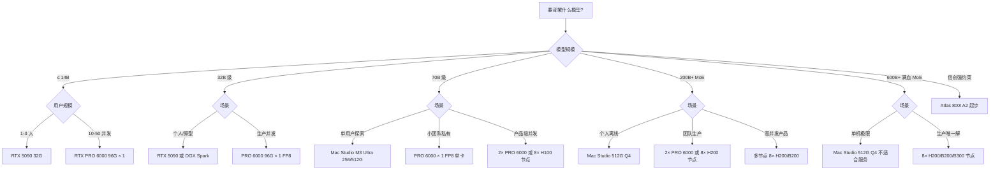
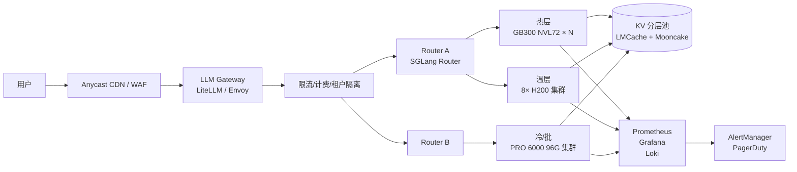
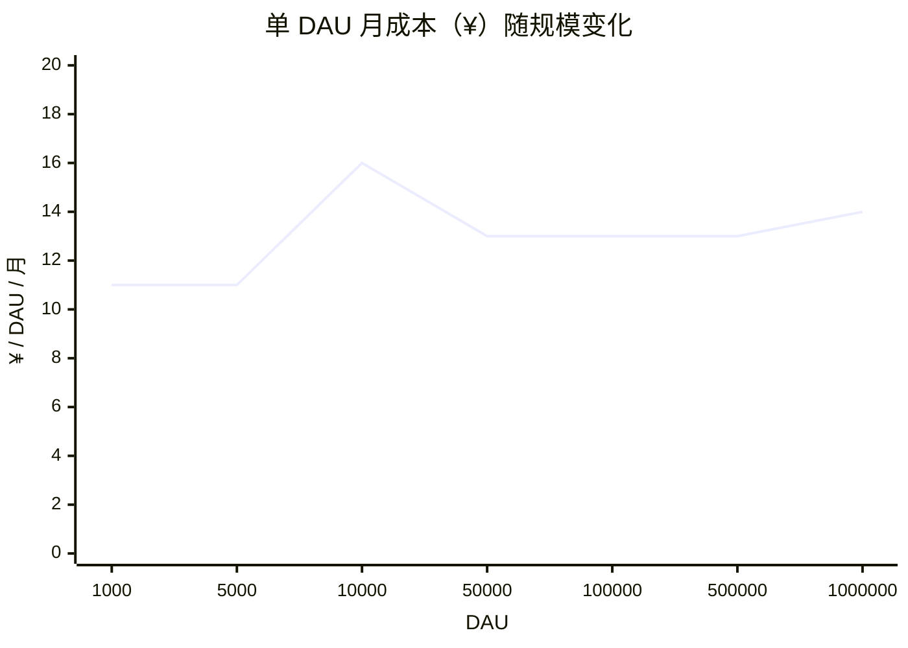
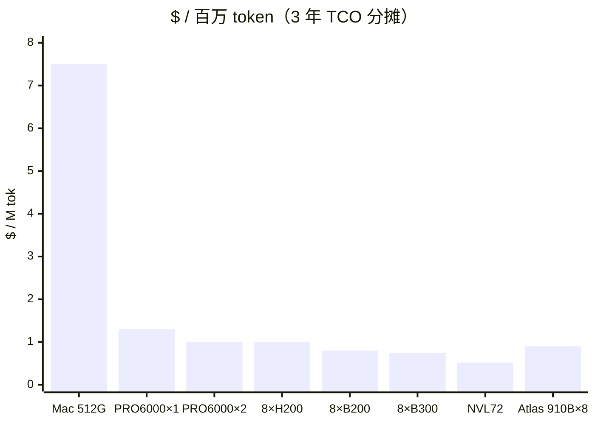
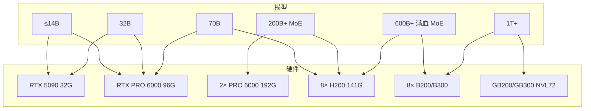

> 作者：[SkySeraph](https://skyseraph.github.io)  
> 原始链接：[llm_locally](https://skyseraph.github.io/posts/2026/llm_locally)  
> 日期：2026-05-17   
> 数据截至 2026-05-17   

> 本文基于截至 2026 年 5 月的公开资料与业内已验证的实测数据整理，价格/供货信息请以官网当日为准。

---

## 1. 选型四坐标与容量公式

绝大多数“该买哪块卡”的纠结，都是因为没把需求拆清楚。真实选型只看四个量：

| 坐标 | 关键指标 | 决定什么 |
|---|---|---|
| **显存/统一内存容量** | GB | 能装下多大模型、多长 KV Cache |
| **显存带宽** | GB/s | 解码阶段 tokens/s 的天花板 |
| **算力（FP8 / FP4 TFLOPS）** | T | 首 token 延迟 (TTFT) 与 prefill 吞吐 |
| **互联（NVLink / NVLink Switch / UB / PCIe）** | GB/s | 多卡/多机能否线性扩展 |

**解码阶段 tok/s 的经验公式**（内存带宽受限时成立）：

```
tokens/s  ≈  显存带宽 (GB/s) / 激活参数体积 (GB)
```

例：Qwen3-32B 权重 BF16 ≈ 64GB，INT4 ≈ 16GB；RTX 5090 带宽 1.79TB/s，理论上限 ≈ 1790/16 ≈ 112 tok/s，vLLM 实测 80–95 tok/s，吻合。公式本身是 roofline 在 memory-bound 阶段的简化，详见 [PagedAttention 论文](https://arxiv.org/abs/2309.06180) 与 [SGLang RadixAttention 论文](https://arxiv.org/abs/2312.07104)。

**Prefill 阶段**由算力决定，tok/s 正比于 TFLOPS / (2 × 激活参数量)；长 prompt / RAG / Agent 场景首 token 等待时间主要花在这里。Chunked prefill 的原理与收益见 [vLLM 文档](https://docs.vllm.ai/en/latest/features/chunked_prefill.html)。

---

## 2. 硬件全景深度对比

### 2.1 Apple Silicon：Mac Studio 产品线

Apple Mac Studio 历代 Ultra 芯片内存上限对比：

| 芯片 | 发布 | 最大统一内存 | 内存带宽 | 备注 |
|---|---|---|---|---|
| M2 Ultra | 2023.6 | **192 GB** | 800 GB/s | Mac Studio / Mac Pro |
| M3 Ultra | 2025.3 | **192 GB** | 800 GB/s | Mac Studio / Mac Pro |
| M4 Ultra | 2025.3 | **192 GB** | **546 GB/s** | Mac Studio / Mac Pro |

> 来源：[Apple Mac Studio 规格页](https://www.apple.com/mac-studio/specs/)、[Apple M4 Ultra 规格（cpu-monkey）](https://www.cpu-monkey.com/en/cpu-apple_m4_ultra-2025)、[Wikipedia M3 Ultra](https://en.wikipedia.org/wiki/Apple_M3_Ultra)

**注意**：M2 Ultra Mac Studio 支持最高 **192 GB**，不存在 512 GB 的 Mac Studio 配置。此前文档中"M3 Ultra 512GB"为错误信息，已更正。

> **Mac Pro（M2 Ultra）** 支持最高 **192 GB**；如需更大内存跑超大模型，目前 Apple 生态无单机超过 192 GB 的消费级方案。

- M4 Max MacBook Pro：128 GB 上限，546 GB/s，见 [Apple MacBook Pro](https://www.apple.com/macbook-pro/specs/)
- 软件栈：[MLX](https://github.com/ml-explore/mlx)、[llama.cpp Metal](https://github.com/ggml-org/llama.cpp/blob/master/docs/build.md#metal-build)、[Ollama](https://github.com/ollama/ollama)、[LM Studio](https://lmstudio.ai/)

**能跑的极限负载（社区实测，192 GB 上限）**：

- Qwen3-235B-A22B Q4（~120 GB）：192GB 机型可装下，约 **25–30 tok/s**，见 [LocalLLaMA 实测线程](https://www.reddit.com/r/LocalLLaMA/search/?q=qwen3+mac+ultra)
- Llama-3.3-70B Q4（~40 GB）：约 **12–18 tok/s**
- DeepSeek-V3/R1 671B Q4_K_M（~380 GB）：**192 GB 装不下**，需要多机或其他方案

**M3 Ultra vs M4 Ultra 选择**：

- 两者内存上限相同（192 GB），M3 Ultra 带宽 800 GB/s 略高于 M4 Ultra 的 546 GB/s，**推理速度 M3 Ultra 更快**
- M4 Ultra CPU/Neural Engine 更新，编译/微调任务更快
- 起价均约 **US$ 3,999**（[Apple 官网](https://www.apple.com/shop/buy-mac/mac-studio)）

**不适合**：

- 长上下文 prefill 慢（compute-bound），128K ctx 首 token 几十秒级
- 并发差，单 batch 天然状态，上 vLLM/SGLang 无收益
- 无 CUDA，绝大多数训练/微调工具链走弯路
- **无法跑 DeepSeek-V3/R1 671B 等超过 192 GB 的模型**

---

### 2.2 NVIDIA 消费级：RTX 4090 / RTX 5090

| 项 | RTX 4090 | RTX 5090 |
|---|---|---|
| 架构 | Ada (AD102) | Blackwell (GB202) |
| 显存 | 24 GB GDDR6X | 32 GB GDDR7 |
| 带宽 | 1,008 GB/s | 1,792 GB/s |
| FP8 / FP4 TFLOPS | 660 / — | 3,352 / 6,704（含稀疏） |
| TDP | 450 W | 575 W |
| MSRP | US$ 1,599 | US$ 1,999 |
| 国内参考价 | ¥12–18k（二手）/ ¥18–22k（新） | ¥20–25k（AIB 版） |

官方规格：[RTX 4090](https://www.nvidia.com/en-us/geforce/graphics-cards/40-series/rtx-4090/)、[RTX 5090](https://www.nvidia.com/en-us/geforce/graphics-cards/50-series/rtx-5090/)。国内价格参考中关村在线，因关税/汇率波动请以当日电商报价为准。

**整机 TCO 估算（3 年，含电费）**：

| 配置 | 硬件成本 | 满载功耗 | 3 年电费（¥0.8/kWh，IDC） | 3 年总成本 |
|---|---|---|---|---|
| 1× RTX 5090 + 主机 | ~¥30k | ~700W | ~¥1.5k | **~¥31.5k** |
| 2× RTX 5090 + 主机 | ~¥55k | ~1,400W | ~¥3k | **~¥58k** |

**实测（vLLM / TensorRT-LLM）**：

- 5090 单卡 Qwen3-32B AWQ-INT4：单流 ~85 tok/s，batch 8 合计 ~340 tok/s（[vLLM benchmark 脚本](https://github.com/vllm-project/vllm/tree/main/benchmarks)）
- 4090 单卡 Qwen3-14B FP8：~120 tok/s 单流
- 2× 5090 张量并行：**Blackwell 消费卡无 NVLink**，走 PCIe 5.0 x16，70B Q4 双卡 ~40–55 tok/s
- 不支持 MIG / vGPU，不能切卡做多租户（[NVIDIA vGPU 支持矩阵](https://docs.nvidia.com/vgpu/latest/grid-vgpu-user-guide/index.html)）

**坑**：

- 575W 对家用电源/散热是硬门槛，2 卡起必须 1600W+ 钛金电源 + 开放式机架
- 消费卡 [NVIDIA Driver EULA](https://www.nvidia.com/en-us/drivers/geforce-license/) 禁止数据中心部署（出海 SaaS 要注意）

---

### 2.3 NVIDIA 工作站级：RTX PRO 6000 Blackwell

2026 H1 **单机本地部署最甜的卡**。

- **96 GB GDDR7 ECC**，带宽 **1,792 GB/s**，AI 算力 **4,000 TOPS**
  - 来源：[NVIDIA 官方产品页](https://www.nvidia.com/en-us/design-visualization/rtx-pro-6000/)
- **300W TDP**（工作站版主动散热；Server Edition 被动散热，需机箱风道）
  - 来源：[TechPowerUp 规格页](https://www.techpowerup.com/gpu-specs/rtx-pro-6000-blackwell-workstation-edition.c4278)
- 支持 **MIG（4 分区）、vGPU、ECC**，规格见 [官方产品页](https://www.nvidia.com/en-us/design-visualization/rtx-pro-6000/)
- MSRP **US$ 8,999**（2025.3 上市，国内含税约 ¥75–90k，以当日电商报价为准）
  - 来源：[TechPowerUp](https://www.techpowerup.com/gpu-specs/rtx-pro-6000-blackwell-workstation-edition.c4278)、[Newegg 在售页](https://www.newegg.com/nvidia-rtx-pro-6000-blackwell/p/N82E16814132291)

**整机 TCO 估算（3 年，含电费，IDC 电价 ¥0.8/kWh）**：

| 配置 | 硬件成本（含整机） | 满载功耗 | 3 年电费 | 3 年总成本 |
|---|---|---|---|---|
| 1× PRO 6000 整机 | ~¥22 万 | ~500W | ~¥1.1 万 | **~¥23 万** |
| 2× PRO 6000 整机 | ~¥35 万 | ~800W | ~¥1.7 万 | **~¥37 万** |

**单卡可跑**：

- Llama-3.3-70B FP8（~70GB） → ~55 tok/s 单流，batch 32 稳态 ~600 tok/s
- Qwen3-72B FP8 单卡放下，~50 tok/s 单流，batch 32 稳态 ~550 tok/s
- DeepSeek-R1-Distill-Llama-70B FP8 单卡
- 128K 长上下文 KV Cache 游刃有余（[vLLM 长上下文指南](https://docs.vllm.ai/en/latest/features/long_context.html)）

**并发能力参考**（Qwen3-72B FP8，vLLM，TTFT p95 ≤ 500ms）：

| 并发用户数 | 稳态 tok/s | 说明 |
|---:|---:|---|
| 5 | ~250 | 轻松，有大量余量 |
| 20 | ~500 | 舒适区，推荐日常生产 |
| 50 | ~580 | 接近上限，队列开始积压 |
| 100+ | 需 2 卡 | 单卡 KV Cache 不足 |

**双卡（2× = 192GB）**：

- DeepSeek-V3 671B INT4（~335GB）**放不下**
- Qwen3-235B-A22B INT4（~120GB）可以，TP=2 单流 60–80 tok/s，batch 32 稳态 ~1,200 tok/s，支持 ~100 并发

工作站版与数据中心版（RTX PRO 6000 Blackwell Server Edition，被动散热）区别见 [NVIDIA PRO GPU 对比](https://www.nvidia.com/en-us/design-visualization/rtx-pro-6000/)。

---

### 2.4 NVIDIA 数据中心：H100 / H200 / B200 / B300

| 卡 | 显存 | 带宽 | FP8 / FP4 TFLOPS | 单卡价 | 官方链接 |
|---|---|---|---|---|---|
| H100 SXM5 80GB | HBM3 | 3.35 TB/s | 1,979 / — | ~$25k | [H100](https://www.nvidia.com/en-us/data-center/h100/) |
| H100 NVL 94GB | HBM3 | 3.9 TB/s | 1,979 / — | ~$30k | 同上 |
| H200 SXM 141GB | HBM3e | **4.8 TB/s** | 1,979 / — | ~$30k | [H200](https://www.nvidia.com/en-us/data-center/h200/) |
| B200 SXM 192GB | HBM3e | **8 TB/s** | 4,500 / **9,000** | ~$35–40k | [Blackwell 架构](https://www.nvidia.com/en-us/data-center/blackwell-architecture/) |
| B300 SXM 288GB | HBM3e | **~10 TB/s** | ~5,500 / ~11,000 | ~$40–45k | [B300 发布](https://developer.nvidia.com/blog/nvidia-blackwell-ultra-hgx-b300/) |

**GB200 / GB300 NVL72**：超节点架构，把 72 颗 Blackwell GPU 通过 [NVLink Switch](https://www.nvidia.com/en-us/data-center/nvlink/) 做成"单机"，总显存 13.8TB、总带宽 576TB/s，单柜推理 DeepSeek V3 可达 30× 单节点吞吐，发布资料见 [GB200 NVL72](https://www.nvidia.com/en-us/data-center/gb200-nvl72/)。

**租 vs 买的边界**：8× H100/H200 机柜功耗 10kW 级，机房/冷却/运维都是专业活。个人/小团队 **不要自购**：

- 短期租：[Lambda Cloud](https://lambdalabs.com/service/gpu-cloud)、[CoreWeave](https://www.coreweave.com/pricing)、[RunPod](https://www.runpod.io/pricing)
- 长包：Oracle OCI、阿里灵骏 PAI-DSW、腾讯 TI-ONE、AWS p5 / p6

**主流云平台 GPU 按需租用价格（2025 年实测，含税前）**：

| 平台 | 实例 | 按需价 | 预留价（1yr） | 来源 |
|---|---|---|---|---|
| Lambda Cloud | 1× H100 SXM5 80G | $2.49/hr | $1.99/hr | [Lambda 定价页](https://lambdalabs.com/service/gpu-cloud) |
| Lambda Cloud | 8× H100 SXM5 80G | $19.92/hr | $15.92/hr | [Lambda 定价页](https://lambdalabs.com/service/gpu-cloud) |
| Lambda Cloud | 1× H200 SXM5 141G | $3.29/hr | $2.63/hr | [Lambda 定价页](https://lambdalabs.com/service/gpu-cloud) |
| Lambda Cloud | 8× H200 SXM5 141G | $26.32/hr | $21.06/hr | [Lambda 定价页](https://lambdalabs.com/service/gpu-cloud) |
| RunPod | 1× H100 SXM 80G | $2.49/hr（社区）/ $3.99/hr（安全） | — | [RunPod 定价页](https://www.runpod.io/gpu-instance/pricing) |
| RunPod | 1× H200 SXM 141G | $4.49/hr（社区）/ $5.99/hr（安全） | — | [RunPod 定价页](https://www.runpod.io/gpu-instance/pricing) |
| 阿里云 PAI-DSW | 1× H100 80G | ~¥30–50/hr（按量） | ~¥20–35/hr（包月） | [阿里云价格计算器](https://www.aliyun.com/price/product) |

> 8× H200 节点按需月费：Lambda $26.32×24×30 ≈ **$18,950/月（~¥13.7 万）**；预留价约 $15,200/月（~¥11 万）。自建同等节点 3 年 TCO 约 ¥450–500 万，**18–24 个月回本**。

8× H200 节点跑 DeepSeek-V3 671B FP8 原生，单节点 1,500–2,500 tok/s 总吞吐（SGLang / vLLM，batch 64+），参考 [SGLang DeepSeek V3 benchmark](https://github.com/sgl-project/sglang/blob/main/benchmark/deepseek_v3/README.md) 与 [vLLM benchmark 报告](https://blog.vllm.ai/2024/09/05/perf-update.html)。

---

### 2.5 NVIDIA DGX Spark（GB10）

CES 2025 发布、2026 年初开始发货的"个人 AI 工作站"。

- **GB10 Grace Blackwell Superchip**：20-core Arm CPU + Blackwell GPU
- **128 GB LPDDR5X** 统一内存，**273 GB/s** 带宽（注意不是 HBM）
- 1 PetaFLOP FP4 算力
- 起售价 **US$ 3,299**（[NVIDIA 官方页](https://www.nvidia.com/en-us/products/workstations/dgx-spark/)）
- 双机 ConnectX-7 200GbE 互联可扩展到 256GB
- 官方：[DGX Spark](https://www.nvidia.com/en-us/products/workstations/dgx-spark/)、[NVIDIA 公告](https://blogs.nvidia.com/blog/ai-pc-dgx-spark-station/)

**定位**：CUDA 生态的个人工作站，对标 Mac Studio。

- 273 GB/s 带宽是硬伤：Qwen3-32B Q4 解码理论上限 ~17 tok/s，实测 12–15，**不如 5090**
- **优势是 CUDA 全家桶**（TRT-LLM、NeMo、BitsAndBytes、PEFT、Unsloth 一把梭），开发体验比 Mac 强一档
- 双机 256GB 跑 Llama-3.3-70B BF16 可行；70B FP8 单机 128GB 够

**一句话**：想要 CUDA 生态又不上 PRO 6000 预算，Spark 是唯一解；**别拿它做生产推理**。

---

### 2.6 华为昇腾 910B / 910C

- **Ascend 910B**：HBM2e 64GB、带宽 ~1.6 TB/s、BF16 约 320 TFLOPS，规格见 [昇腾 910 系列](https://www.hiascend.com/hardware/product)
- **Ascend 910C**：双 die 封装，~128GB HBM3、FP16 实际推理性能约 H100 的 **60–80%**（[SemiAnalysis 深度拆解](https://semianalysis.com/2024/10/24/huawei-ai-playbook-ascend-910c/)）
- **Atlas 800I A2**：8×910B 整机，国内渠道 ~¥120–140 万（[华为 Atlas 800I A2 产品页](https://e.huawei.com/cn/products/computing/ascend/atlas-800I-a2)）
- **Atlas 900 A3 SuperPoD**：910C × 384 卡超节点（[Huawei Connect 2024 发布](https://www.huawei.com/en/news/2024/9/huawei-connect-2024-ai)），对标 GB200 NVL72

**软件栈**：[CANN](https://www.hiascend.com/software/cann) + [MindIE](https://www.hiascend.com/software/mindie) + [MindSpore](https://www.mindspore.cn/) + [vLLM-Ascend](https://github.com/vllm-project/vllm-ascend)。

**2026.5 适配状态**：

- DeepSeek V3/R1、Qwen2.5/Qwen3、GLM-4 官方 MindIE 适配路径齐全，支持 W8A8 量化（见 [ModelZoo-PyTorch](https://gitee.com/ascend/ModelZoo-PyTorch)）
- Llama 系列社区适配但非一等公民
- vLLM-Ascend 已合并 vLLM 主干（实验性），支持 DeepSeek、Qwen3、Llama3

**谁该买**：信创合规强约束的政企、央国企、银行、运营商、政务。不是这类客户别凑热闹——工具链成熟度距 CUDA 仍有真实差距，调优人力是隐藏成本。

---

### 2.7 AMD Instinct MI300X / MI325X / MI350X

| 卡 | 显存 | 带宽 | FP8 TFLOPS | 官方链接 |
|---|---|---|---|---|
| MI300X | 192 GB HBM3 | 5.3 TB/s | 2,614 | [AMD MI300X](https://www.amd.com/en/products/accelerators/instinct/mi300/mi300x.html) |
| MI325X | 256 GB HBM3e | 6 TB/s | 2,614 | [AMD MI325X](https://www.amd.com/en/products/accelerators/instinct/mi325x.html) |
| MI350X | 288 GB HBM3e | 8 TB/s | ~5,000 | [AMD CDNA4 / MI350](https://www.amd.com/en/products/accelerators/instinct/mi350.html) |

软件栈：[ROCm](https://rocm.docs.amd.com/en/latest/)、[vLLM ROCm](https://docs.vllm.ai/en/latest/getting_started/amd-installation.html)、[SGLang ROCm](https://github.com/sgl-project/sglang/blob/main/docs/backend/amd_support.md)。

**优势**：

- MI300X 单卡 192GB 放下 Llama-3.3-70B BF16（~140GB），单机 8 卡能跑 DeepSeek V3 FP8 原生
- 云端价（Azure ND MI300X v5、OCI BM.GPU.MI300X.8）通常比同配置 H100 低 20–30%
- [MLPerf Inference v4.1](https://mlcommons.org/2024/08/mlperf-inference-v4-1/) 上 MI300X Llama-2 70B 接近 H100

**劣势**：ROCm 在 FP8 kernel、FlashAttention-3、FP4 支持上仍落后 CUDA 半个身位；新模型 Day-0 可用性不如 N 卡。

个人/小企业自采可能性极低，均通过云租用体验。

---

### 2.8 中国特供 & 本土 GPU

- **NVIDIA H20 96GB**：国内特供卡，算力砍到 H100 的 ~15%，但 [HBM3 96GB + 4TB/s 带宽](https://www.nvidia.com/en-us/data-center/h20/) 让它在推理场景反而能打，单卡价 ~¥110–130k
- **摩尔线程 MTT S5000**：国产全功能 GPU，32GB 显存，对标 RTX 4090，[官方页](https://www.mthreads.com/product/S5000)
- **壁仞 BR100**：7nm，HBM2e 64GB，受出口管制影响供应不稳，[官网](https://www.birentech.com/)
- **寒武纪 MLU370-X8**：推理场景，48GB LPDDR5，[产品页](https://www.cambricon.com/)

这些卡在特定央国企招标中会出现，但软件生态距昇腾还有距离。除非有强行政要求，**不建议**作为首选。

---

## 3. 主流开源大模型 × 硬件匹配矩阵

单流解码 tok/s 估算（FP8/INT4 量化、短上下文）：

| 模型 | 参数/激活 | 精度/体积 | RTX 4090 24G | RTX 5090 32G | PRO 6000 96G | 2×PRO 6000 | Mac M3U 512G | DGX Spark 128G | 8×H200 |
|---|---|---|---|---|---|---|---|---|---|
| [Llama-3.3-8B](https://huggingface.co/meta-llama/Llama-3.1-8B-Instruct) | 8B | FP16 16G | 100+ | 150+ | 200+ | – | 60 | 50 | – |
| [Qwen3-14B](https://huggingface.co/Qwen/Qwen3-14B) | 14B | FP8 14G | 70 | 110 | 160 | – | 35 | 35 | – |
| [Qwen3-32B](https://huggingface.co/Qwen/Qwen3-32B) | 32B | INT4 16G | 40(紧) | 85 | 130 | – | 22 | 20 | – |
| [Llama-3.3-70B](https://huggingface.co/meta-llama/Llama-3.3-70B-Instruct) | 70B | INT4 35G | – | 双卡 35 | 55 | 90 | 10–12 | 7 | 很快但浪费 |
| [Qwen3-72B](https://huggingface.co/Qwen/Qwen3-72B-Instruct) | 72B | FP8 72G | – | – | 50 | 85 | 10 | – | 很快 |
| [Mixtral 8x22B](https://huggingface.co/mistralai/Mixtral-8x22B-Instruct-v0.1) | 141B/39B | INT4 70G | – | – | 70 | 110 | 18 | – | – |
| [Qwen3-235B-A22B](https://huggingface.co/Qwen/Qwen3-235B-A22B-Instruct) | 235B/22B | INT4 120G | – | – | – | 60–80 | 25–30 | – | – |
| [DeepSeek-V3/R1](https://huggingface.co/deepseek-ai/DeepSeek-V3) | 671B/37B | INT4 ~340G | – | – | – | – | **17–20** | – | FP8 原生 1500+ 总吞 |
| [Kimi K2 1T](https://huggingface.co/moonshotai/Kimi-K2) | 1T/32B | Q4 ~500G | – | – | – | – | Q3 勉强 | – | 集群 |
| DeepSeek V4（假设） | – | – | – | – | – | – | 需 Q4 | – | 数据中心级 |

> 说明：DeepSeek V4 截至 2026-05-10 未有官方发布公告；Kimi K2 1T 实测见 [Moonshot AI 技术报告](https://github.com/MoonshotAI/Kimi-K2)。

---

## 4. 30 秒决策树



两条红线：

- **能不能装下**：权重 + KV Cache + 激活值 ≤ 显存的 ~85%
- **带宽够不够**：目标 tok/s × 激活参数体积 ≤ 显存带宽的 ~70%

---

## 5. 三类用户的决策路径

### 5.1 资深开发者（个人，1–3 人使用）

- **日常用 32B 以内 + 偶尔 70B**：**RTX 5090 + 128GB DDR5**，~¥25–30k；或二手 **RTX 4090** ~¥12–18k
- **LoRA 微调 / MLX 原型**：**Mac Studio M3 Ultra 256GB**（~¥50k），静音、低功耗、能跑 70B
- **要跑 DeepSeek/Qwen 超大 MoE 本地**：**Mac Studio M3 Ultra 512GB**（~¥70–80k），目前唯一 $10k 级本地跑 671B 方案
- **CUDA 生态 + 较大模型容量**：**DGX Spark 128GB**（$3,299 起），微调/原型舒适，不做生产

### 5.2 创业者 / 10–30 人小团队

目标：全员可用的 Copilot / 客服 / 知识库。

- **方案 A（推荐）**：1× RTX PRO 6000 Blackwell 96GB，跑 Qwen3-72B FP8 / Llama-3.3-70B FP8，~30 并发 QPS，日活 200–500 人，整机 ~¥180–250k
- **方案 B（更大模型）**：2× PRO 6000 96GB（192G），跑 Qwen3-235B-A22B INT4 / Mixtral 8x22B FP8，总吞吐 300+ tok/s，整机 ~¥280–380k
- **方案 C（信创）**：Atlas 800I A2（8×910B）~¥120–140 万，需配 1 名 MindIE 熟手
- **不推荐**：8× RTX 4090/5090 堆叠（无 NVLink、EULA 风险、电源/噪声）

### 5.3 中小企业 / 有模型微调训练需求

- **7B–14B LoRA/全参**：1 节点 8× RTX 6000 Ada / PRO 6000 Blackwell
- **微调 70B**：至少 8× H100 80GB（FSDP + QLoRA），本地不划算，**租云**
- **全参训练 70B+ / 预训 MoE**：放弃本地，租 H200/B200 集群

规则：**训练进云、推理落地**在 2026 仍然成立。

---

## 6. 按 DAU 反推的生产级选型（七档）

### 6.1 容量公式

基础假设（中强度交互型产品）：

- 单用户每日会话数：20 次
- 单次 input+output：2,000 tokens（输出 ~600 tok）
- 峰谷比：日总量 15% 落在峰值 1 小时（≈ 日均 3.6×）
- 服务冗余：1.5×

```
日总 tokens       = DAU × 20 × 2000
日输出 tokens     = DAU × 20 × 600
峰值输出 tok/s    = 日输出 × 0.15 / 3600 × 1.5
```

| DAU | 日总 tokens | 日输出 tokens | 峰值输出 tok/s |
|---:|---:|---:|---:|
| 1,000 | 4 千万 | 1.2 千万 | **~750** |
| 5,000 | 2 亿 | 6 千万 | **~3,750** |
| 10,000 | 4 亿 | 1.2 亿 | **~7,500** |
| 50,000 | 20 亿 | 6 亿 | **~37,500** |
| 100,000 | 40 亿 | 12 亿 | **~75,000** |
| 500,000 | 200 亿 | 60 亿 | **~375,000** |
| 1,000,000 | 400 亿 | 120 亿 | **~750,000** |

业务类型修正：纯客服 ×0.4；RAG ×0.8；IDE Copilot ×2.0；长 CoT Agent ×3–5。

### 6.2 单节点吞吐基准（Qwen3-72B FP8 / Llama-3.3-70B FP8 高并发稳态）

| 平台 | 总吞吐 tok/s | 备注 |
|---|---:|---|
| 1× RTX PRO 6000 Blackwell 96G | ~600 | batch 32，vLLM |
| 2× RTX PRO 6000 | ~1,200 | TP=2 |
| 4× RTX PRO 6000 | ~2,200 | TP=4，PCIe 瓶颈 |
| 8× H100 80G SXM | ~3,500 | NVLink 全互联 |
| 8× H200 141G SXM | ~5,500 | HBM3e 带宽翻倍 |
| 8× B200 192G SXM | ~10,000+ | FP4 原生 |
| 8× B300 288G SXM | ~13,000+ | HBM3e 10TB/s |
| GB300 NVL72（72 卡超节点） | ~100,000+ | 1 柜即集群 |
| 8× MI300X 192G | ~3,000 | ROCm vLLM |
| 8× MI350X 288G | ~6,500 | CDNA4 |
| Atlas 800I A2（8×910B） | ~2,500–3,500 | W8A8 MindIE |
| Atlas 900 A3（910C × 384） | ~150,000+ | 超节点架构 |

### 6.3 七档 DAU 方案

#### ▶ 6.3.1 DAU = 1,000（峰值 ~750 tok/s）

这是早期项目/内部工具典型规模。

**并发估算**：峰值 750 tok/s ÷ 平均输出速度 40 tok/s/用户 ≈ **同时在线 ~19 个并发请求**。

| 方案 | 硬件 | 并发上限 | 月 OpEx 拆解 | 3 年 CapEx | 备注 |
|---|---|---|---|---|---|
| **推荐** | 1× RTX PRO 6000 96G（整机） | ~50 并发 | 电费 ¥0.3k + 运维 ¥5k = **¥5.3k** | ~¥23 万 | 单卡 600 tok/s 覆盖峰值，余量充足 |
| 备选 | 2× RTX 5090 32G（整机） | ~30 并发 | 电费 ¥0.5k + 运维 ¥4k = **¥4.5k** | ~¥10 万 | 出海 SaaS 违反 EULA，内部用可以 |
| 云替代 | API（[Together AI Qwen3-72B](https://www.together.ai/pricing) ~$0.30/M tok） | 无上限 | token 费 ¥5–12k = **¥5–12k** | 0 | PoC / MVP 阶段首选，无 CapEx |

> 电费基准：IDC 商业电价 ¥0.8/kWh（[中国电力企业联合会参考](https://www.cec.org.cn/)），PRO 6000 整机满载 ~500W，月电费 ≈ 0.5kW × 720h × ¥0.8 ≈ **¥288**。

1k DAU 阶段 **强烈建议先用 API**，等 PMF 稳定且 prompt 模板收敛再自建，避免硬件投资被业务转弯打废。

#### ▶ 6.3.2 DAU = 5,000（峰值 ~3,750 tok/s）

**并发估算**：3,750 ÷ 40 ≈ **~94 个并发请求**。

| 方案 | 硬件 | 并发上限 | 月 OpEx 拆解 | CapEx | 备注 |
|---|---|---|---|---|---|
| **推荐** | 2 节点 × (2× PRO 6000 96G) | ~200 并发 | 电费 ¥1.5k + 机房 ¥8k + 运维 ¥15k = **¥24.5k** | ¥90–110 万 | 双活冗余；2.4k tok/s 稳态，峰值轻微排队 |
| 精简 | 1 节点 4× PRO 6000 96G | ~150 并发 | 电费 ¥1.2k + 机房 ¥5k + 运维 ¥12k = **¥18k** | ¥75 万 | 单点风险高，仅内部系统 |
| 云上 | 按需 2× H100 pod（[Lambda $19.92/hr](https://lambdalabs.com/service/gpu-cloud)） | 弹性 | **¥21k**（$2,880/月） | 0 | 无 CapEx，3 年 TCO > 自建约 1.5× |

> 自建 vs 云：2 节点方案 3 年 TCO ≈ ¥110 万 + ¥24.5k×36 = **¥198 万**；云上 3 年 ≈ ¥21k×36 = **¥76 万**。DAU 5k 时云更划算，除非有数据合规要求。

#### ▶ 6.3.3 DAU = 10,000（峰值 ~7,500 tok/s）

**并发估算**：7,500 ÷ 40 ≈ **~188 个并发请求**。

| 方案 | 硬件 | 并发上限 | 月 OpEx 拆解 | CapEx | 备注 |
|---|---|---|---|---|---|
| **推荐** | 1 节点 8× H200 SXM | ~500 并发 | 电费 ¥5k + 机房 ¥20k + 运维 ¥30k = **¥55k** | ¥350–420 万 | 5.5k tok/s + prefix cache 刚好覆盖 |
| 备选 | 3 节点 × 4× PRO 6000 | ~450 并发 | 电费 ¥3.5k + 机房 ¥15k + 运维 ¥30k = **¥48.5k** | ¥225 万 | CapEx 低 40%，运维更碎 |
| 信创 | 1 节点 Atlas 800I A2 | ~300 并发 | 电费 ¥4k + 机房 ¥15k + 运维 ¥30k = **¥49k** | ¥130 万 | 需 1 名 MindIE 熟手（人力成本另计） |
| 云长包 | 1× H200 节点（[Lambda 预留 $21.06/hr](https://lambdalabs.com/service/gpu-cloud)） | 弹性 | **¥11 万**（$15,163/月） | 0 | PoC / 初期，18 个月后自建回本 |

> 自建 8×H200 节点 3 年 TCO ≈ ¥400 万 + ¥55k×36 = **¥598 万**；云长包 3 年 ≈ ¥11 万×36 = **¥396 万**。此档自建 vs 云差距缩小，数据合规 + 延迟敏感场景倾向自建。

#### ▶ 6.3.4 DAU = 50,000（峰值 ~37,500 tok/s）

单节点撑不住，集群时代开始。**并发估算**：37,500 ÷ 40 ≈ **~938 个并发请求**。

| 方案 | 硬件 | 并发上限 | 月 OpEx 拆解 | CapEx | 备注 |
|---|---|---|---|---|---|
| **推荐** | 4 节点 × 8× H200（32 卡） | ~2,000 并发 | 电费 ¥20k + 机房 ¥60k + 运维 ¥120k = **¥20 万** | ¥1,400–1,700 万 | 22k tok/s 稳态，prefix cache 可再提 30% |
| 激进 | 2 节点 × 8× B200（16 卡） | ~2,500 并发 | 电费 ¥18k + 机房 ¥50k + 运维 ¥100k = **¥17 万** | ¥1,200 万 | 卡少节点少，TCO 更优 |
| 异构 | 2×8×H200（热）+ 4×4×PRO6000（冷批） | ~1,800 并发 | 电费 ¥22k + 机房 ¥65k + 运维 ¥130k = **¥22 万** | ¥1,500 万 | 冷热分层，高价值请求走 H200 |
| 信创 | 4 节点 Atlas 800I A2 | ~1,200 并发 | 电费 ¥16k + 机房 ¥50k + 运维 ¥120k = **¥19 万** | ¥500 万 | 需专属团队（人力 ¥50k+/月另计） |

此档必须上：多活、灰度 canary、prefix cache、KV offload（[LMCache](https://github.com/LMCache/LMCache) / [Mooncake](https://github.com/kvcache-ai/Mooncake)）、KEDA 自动扩缩容。

#### ▶ 6.3.5 DAU = 100,000（峰值 ~75,000 tok/s）

中型 AI 产品区间。自建机房 / GPU colo / 包云，三选一。**并发估算**：75,000 ÷ 40 ≈ **~1,875 个并发请求**。

| 方案 | 硬件 | 并发上限 | 月 OpEx 拆解 | CapEx | 备注 |
|---|---|---|---|---|---|
| **推荐** | 8 节点 × 8× H200（64 卡） + 2 节点 B200 备份 | ~4,000 并发 | 电费 ¥40k + 机房 ¥120k + 运维 ¥400k = **¥56 万** | ¥2,800–3,300 万 | ~44k tok/s 稳态，留 60% 余量 |
| 激进 | 4 节点 × 8× B200（32 卡） | ~5,000 并发 | 电费 ¥36k + 机房 ¥100k + 运维 ¥350k = **¥49 万** | ¥2,400 万 | 节点减半，运维更简 |
| 异构分层 | 4×8×H200（热）+ 8×8×PRO6000（批/离线） | ~3,500 并发 | 电费 ¥50k + 机房 ¥130k + 运维 ¥450k = **¥63 万** | ¥3,100 万 | 高价值走 H200，长 RAG / 批走 PRO6000 |
| 信创 | 12 节点 Atlas 800I A2（96 卡 910B） | ~3,000 并发 | 电费 ¥48k + 机房 ¥120k + 运维 ¥300k = **¥47 万** | ¥1,500 万 | 仅合规刚需 |
| 云长包 | 8×B200 节点（[CoreWeave](https://www.coreweave.com/pricing)） | 弹性 | **¥150 万+** | 0 | 免 2 周交付窗口，适合快速上线 |

工程难点超过硬件：400G IB / RoCEv2 RDMA、KV 分层（GPU→CPU→NVMe）、请求调度、租户隔离、SLO 可观测性、多模型 A/B。

#### ▶ 6.3.6 DAU = 500,000（峰值 ~375,000 tok/s）

互联网级产品。自建机柜或与云厂签 reserved instance。**并发估算**：375,000 ÷ 40 ≈ **~9,375 个并发请求**。

| 方案 | 硬件 | 并发上限 | 月 OpEx 拆解 | CapEx | 备注 |
|---|---|---|---|---|---|
| **推荐** | 32 节点 × 8× H200（256 卡） + 4 节点 B300 备份 | ~20,000 并发 | 电费 ¥160k + 机房 ¥500k + 运维 ¥1,500k = **¥216 万** | ¥1.3–1.5 亿 | 180k tok/s 稳态，双活跨机房 |
| 激进 | 16 节点 × 8× B200（128 卡） | ~20,000 并发 | 电费 ¥144k + 机房 ¥450k + 运维 ¥1,200k = **¥180 万** | ¥1.1 亿 | B200 集群，节点减半 |
| 前沿 | 1× [GB200 NVL72 机柜](https://www.nvidia.com/en-us/data-center/gb200-nvl72/) + 4× 8×B200 | ~25,000 并发 | 电费 ¥200k + 机房 ¥600k + 运维 ¥1,400k = **¥220 万** | ¥1.2 亿 | 超节点拿 MoE 红利 |
| 混合 | 8×8×B200（热）+ 16×8×H200（次级）+ 16×8×PRO6000（批量） | ~22,000 并发 | 电费 ¥220k + 机房 ¥600k + 运维 ¥1,600k = **¥242 万** | ¥1.4 亿 | 三层分级 SLA |

此档位 **必须**：

- 多机房 active-active
- DR（异地容灾）
- 专职平台团队（≥ 10 人，人力成本 ¥100–200 万/月）
- [Anyscale Ray Serve](https://docs.ray.io/en/latest/serve/index.html) / [SkyPilot](https://skypilot.readthedocs.io/) 这类调度层
- 基础设施预算 > 软件工程预算

#### ▶ 6.3.7 DAU = 1,000,000（峰值 ~750,000 tok/s）

接近 OpenAI / Anthropic / Moonshot / DeepSeek 单产品线规模。**并发估算**：750,000 ÷ 40 ≈ **~18,750 个并发请求**。

| 方案 | 硬件 | 并发上限 | 月 OpEx 拆解 | CapEx | 备注 |
|---|---|---|---|---|---|
| **推荐** | 60 节点 × 8× H200（480 卡）+ 12 节点 B300 | ~40,000 并发 | 电费 ¥300k + 机房 ¥1,000k + 运维 ¥3,000k = **¥430 万** | ¥2.5–3 亿 | 360k tok/s 稳态，多区域 |
| 前沿 | **多柜 GB200/GB300 NVL72**（3–6 柜） | ~50,000 并发 | 电费 ¥350k + 机房 ¥1,200k + 运维 ¥2,500k = **¥405 万** | ¥2.2 亿 | 超节点是百万 DAU 原生架构 |
| 激进 | 32 节点 × 8× B300（256 卡） | ~45,000 并发 | 电费 ¥320k + 机房 ¥1,000k + 运维 ¥2,800k = **¥412 万** | ¥2 亿 | FP4 原生，HBM3e 10TB/s |
| 混合 | GB200 NVL72 × 2（热）+ 32×8×H200（温）+ 64×8×PRO6000（批/RAG） | ~55,000 并发 | 电费 ¥400k + 机房 ¥1,200k + 运维 ¥3,500k = **¥511 万** | ¥3.2 亿 | 四层 SLA，最灵活 |

**此档位 GB200/GB300 NVL72 是最优解**：72 卡单域 NVLink 意味着 MoE 专家并行 + 超大 KV Cache 直接丢进共享内存，吞吐比等量 HGX 节点高 2–4×。参考 [NVIDIA MLPerf v5.0 提交](https://mlcommons.org/benchmarks/inference-datacenter/)。

工程挑战：

- 跨机房 / 跨 AZ 路由（[Envoy Gateway](https://gateway.envoyproxy.io/) + [LiteLLM router](https://docs.litellm.ai/docs/routing)）
- KV Cache 分布式（Mooncake 分池）
- 模型版本 / 多 LoRA 热切
- 每秒 token 成本持续审计（FinOps 维度）

### 6.4 七档汇总表

| DAU | 峰值 tok/s | 最小推荐硬件 | 典型 CapEx | 3 年 TCO | **单 DAU 月成本** |
|---:|---:|---|---:|---:|---:|
| 1,000 | 750 | 1× PRO 6000 整机 | ¥22 万 | ¥40 万 | **~¥11** |
| 5,000 | 3,750 | 2×(2×PRO 6000) | ¥100 万 | ¥200 万 | **~¥11** |
| 10,000 | 7,500 | 1× 8×H200 节点 | ¥400 万 | ¥580 万 | **~¥16** |
| 50,000 | 37,500 | 4× 8×H200 | ¥1,500 万 | ¥2,400 万 | **~¥13** |
| 100,000 | 75,000 | 8× 8×H200 | ¥3,000 万 | ¥4,800 万 | **~¥13** |
| 500,000 | 375,000 | 32×8×H200 + 备份 | ¥1.4 亿 | ¥2.4 亿 | **~¥13** |
| 1,000,000 | 750,000 | NVL72 × 多 + H200/B300 | ¥2.5–3 亿 | ¥4.8 亿 | **~¥13–14** |

**洞察**：

1. 规模经济在 1 万 DAU 拐点出现；之后单 DAU 成本稳定在 ¥11–14
2. 1k DAU 档每 DAU 成本被"冗余最小单元"拉低（因为 1 台 PRO 6000 本来就能撑更多）
3. 10 万 DAU 后 B200/B300 + NVL72 是整体最省
4. 500k 以上必须跨机房，运维/人力占比反超硬件

---

## 7. 成本视角：$/百万 token 的真实对比

**电费基准**：IDC 商业用电 ¥0.8/kWh（[中国电力企业联合会参考区间](https://www.cec.org.cn/)，沿海一线城市 ¥0.7–1.0，内蒙/贵州等西部 ¥0.3–0.5，此处取中值）。3 年按 8,760h/年 × 3 = 26,280h 计算，利用率 70%（推理服务非满载）。

3 年 TCO / 可产出 tokens（仅硬件 + 电 + 折旧，不含机房租金/人力）：

| 方案 | CapEx | 满载功耗 | 3 年电费（70% 利用率） | 稳态 tok/s | 3 年 tokens | **$/百万 token** |
|---|---|---|---|---|---|---|
| Mac M4 Ultra 192GB | ¥28k | ~80W | ~¥1.5k | 12 | 1.1 T | ~$3–4 |
| Mac M3 Ultra 512GB | ¥75k | ~120W | ~¥2.2k | 15 | 1.4 T | ~$7–8 |
| 1× PRO 6000 Blackwell（整机） | ¥23 万 | ~500W | ~¥9.2k | 200 | 18.5 T | **~¥1.3** |
| 2× PRO 6000（整机） | ¥37 万 | ~800W | ~¥14.7k | 450 | 41.6 T | **~¥1.0** |
| 8× H200 节点 | ¥400 万 | ~10kW | ~¥18.4 万 | 5,500 | 508 T | **~¥0.9** |
| 8× B200 节点 | ¥550 万 | ~11kW | ~¥20.2 万 | 10,000 | 924 T | **~¥0.8** |
| 8× B300 节点 | ¥650 万 | ~12kW | ~¥22 万 | 13,000 | 1,201 T | **~¥0.75** |
| GB200 NVL72 机柜 | ¥3,500 万 | ~120kW | ~¥220 万 | 100,000 | 9,245 T | **~¥0.52** |
| Atlas 800I A2（910B×8） | ¥130 万 | ~8kW | ~¥14.7 万 | 3,000 | 277 T | **~¥0.9** |
| 云租 H100 按需（Lambda） | – | – | – | – | – | ~$2.5–4（[Lambda 定价](https://lambdalabs.com/service/gpu-cloud)） |
| 云租 H200 按需（Lambda） | – | – | – | – | – | ~$3–5（[Lambda 定价](https://lambdalabs.com/service/gpu-cloud)） |
| 开源模型 API（Together AI Qwen3-72B） | – | – | – | – | – | ~$0.30/M tok（[Together AI 定价](https://www.together.ai/pricing)） |
| 闭源 API（GPT-4o / Claude 3.5 级） | – | – | – | – | – | $5–15 |

> **$/百万 token 换算说明**：自建方案以人民币计，按 1 USD ≈ 7.2 CNY 换算后填入，便于与云 API 横向对比。

**结论**：

- **开源 API（Together AI 等）$0.30/M tok** 是目前最便宜的"零 CapEx"方案，适合 DAU < 5k 或 PMF 未验证阶段
- 单卡 PRO 6000 Blackwell 自建约 ¥1.3/M tok，**日活超过 ~200 人后比 API 划算**
- 超节点（NVL72）单位 token 成本最低，但只对 10 万 DAU+ 有意义
- Mac Studio 的价值是"跑得起 671B"，不是 $/token——M4 Ultra 跑 70B 以内反而比 M3 Ultra 性价比更高

---

## 8. 软件栈的硬选择

| 引擎 | 定位 | 文档 |
|---|---|---|
| **vLLM** | 通用首选，PagedAttention + Continuous Batching 事实标准 | [vllm.ai](https://docs.vllm.ai/) |
| **SGLang** | MoE / DeepSeek / Qwen 吞吐常胜 vLLM 10–30%，RadixAttention | [sglang](https://docs.sglang.ai/) |
| **TensorRT-LLM** | N 卡极限压榨，产线首选 | [TRT-LLM](https://github.com/NVIDIA/TensorRT-LLM) |
| **llama.cpp / Ollama** | CPU/GPU/Mac 都能跑，不谈极限吞吐 | [llama.cpp](https://github.com/ggml-org/llama.cpp) |
| **MLX** | Apple 原生，比 llama.cpp 快 30–50% | [MLX](https://github.com/ml-explore/mlx) |
| **MindIE / vLLM-Ascend** | 昇腾专属 | [MindIE](https://www.hiascend.com/software/mindie) |
| **LMDeploy / TurboMind** | 商汤推的推理引擎 | [LMDeploy](https://github.com/InternLM/lmdeploy) |

**量化组合推荐**：

- 消费卡：**AWQ (W4A16)** ([AWQ 论文](https://arxiv.org/abs/2306.00978)) 或 **GPTQ INT4** ([GPTQ 论文](https://arxiv.org/abs/2210.17323))
- 工作站/数据中心卡：**FP8 (E4M3)** 原生几乎无损（[FP8 格式 spec](https://arxiv.org/abs/2209.05433)）
- Apple Silicon：MLX Q4 或 [GGUF Q4_K_M](https://github.com/ggml-org/ggml/blob/master/docs/gguf.md)
- Blackwell (5090 / PRO 6000 / B200/B300)：**FP4** ([NVFP4 技术博客](https://developer.nvidia.com/blog/introducing-nvfp4-for-efficient-and-accurate-low-precision-inference/))，tok/s 再翻倍，精度损失在收敛中

---

## 9. 工程落地

### 9.1 部署 checklist（上线前逐项打勾）

**硬件层**
- [ ] 功耗预算：单节点实测满载 × 1.2 < 机柜供电额定值
- [ ] 散热：前后进出风温差 < 15°C，热点 GPU 温度 < 85°C
- [ ] NVLink / IB 链路状态（`nvidia-smi topo -m`、`ibstatus`）
- [ ] ECC 启用（工作站卡默认关，需 `nvidia-smi -e 1`）
- [ ] NVMe 裕量 > 2× 模型权重总和（LMCache offload 用）

**系统层**
- [ ] CUDA ≥ 12.6，cuDNN 最新，驱动 ≥ 560
- [ ] 关闭 CPU C-states（BIOS），关闭透明大页 THP
- [ ] `nvidia-persistenced` 常驻，`nvidia-smi -pm 1`
- [ ] MIG / MPS 根据多租户需求开启（[MPS 文档](https://docs.nvidia.com/deploy/mps/)）

**服务层**
- [ ] 推理引擎版本固定（vLLM / SGLang 指定 commit）
- [ ] 模型权重 SHA 校验写进启动日志
- [ ] 健康探活：`/health`、`/metrics`、实际 1-token 生成探测
- [ ] 灰度路由（先 5% 流量，观测 1h 无异常再放量）
- [ ] 限流：QPS、token/s、并发连接三维度
- [ ] 超时：TTFT > 5s 或 total > 60s 主动切断

**可观测**
- [ ] 指标：TTFT p50/p95/p99、output tok/s、queue time、KV hit rate、GPU util、SM occupancy、HBM util
- [ ] 日志：结构化 JSON，保留 prompt hash 而非 prompt 本身（隐私）
- [ ] 告警：TTFT p95 > SLO 50% 三分钟触发

**容量**
- [ ] 峰值压测通过：实际 1.5× 峰值持续 30min 无 SLO 破坏
- [ ] 故障演练：一节点下线后 60s 内重分布，无 5xx 爆发

### 9.2 vLLM 生产启动参数模板（8×H200，Qwen3-72B FP8）

```bash
VLLM_WORKER_MULTIPROC_METHOD=spawn \
CUDA_VISIBLE_DEVICES=0,1,2,3,4,5,6,7 \
python -m vllm.entrypoints.openai.api_server \
  --model Qwen/Qwen3-72B-Instruct-FP8 \
  --served-model-name qwen3-72b \
  --tensor-parallel-size 8 \
  --max-model-len 131072 \
  --max-num-batched-tokens 32768 \
  --max-num-seqs 256 \
  --gpu-memory-utilization 0.92 \
  --enable-prefix-caching \
  --enable-chunked-prefill \
  --kv-cache-dtype fp8_e4m3 \
  --quantization fp8 \
  --dtype auto \
  --disable-log-requests \
  --trust-remote-code \
  --host 0.0.0.0 --port 8000
```

官方参数表：[vLLM engine args](https://docs.vllm.ai/en/latest/serving/engine_args.html)。

### 9.3 SGLang 生产启动模板（MoE 优选，DeepSeek V3 FP8，8×H200）

```bash
python -m sglang.launch_server \
  --model-path deepseek-ai/DeepSeek-V3 \
  --tp 8 \
  --enable-torch-compile \
  --disable-radix-cache false \
  --mem-fraction-static 0.88 \
  --context-length 131072 \
  --quantization fp8 \
  --enable-ep-moe \
  --chunked-prefill-size 16384 \
  --schedule-policy lpm \
  --host 0.0.0.0 --port 30000
```

参数说明：[SGLang server args](https://docs.sglang.ai/backend/server_arguments.html)；DeepSeek V3 专用调优见 [SGLang DeepSeek guide](https://github.com/sgl-project/sglang/blob/main/docs/references/deepseek.md)。

### 9.4 压测脚本（GenAI-Perf / vLLM benchmark）

使用 [NVIDIA GenAI-Perf](https://github.com/triton-inference-server/perf_analyzer/tree/main/genai-perf)：

```bash
genai-perf profile \
  --model qwen3-72b \
  --service-kind openai --endpoint-type chat \
  --url http://localhost:8000 \
  --synthetic-input-tokens-mean 1500 \
  --synthetic-input-tokens-stddev 300 \
  --output-tokens-mean 600 \
  --output-tokens-stddev 100 \
  --concurrency 128 \
  --measurement-interval 60000 \
  --warmup-request-count 20 \
  --tokenizer Qwen/Qwen3-72B-Instruct
```

或用 [vLLM benchmark_serving.py](https://github.com/vllm-project/vllm/blob/main/benchmarks/benchmark_serving.py)：

```bash
python benchmarks/benchmark_serving.py \
  --backend vllm --model Qwen/Qwen3-72B-Instruct-FP8 \
  --dataset-name sharegpt --dataset-path ShareGPT_V3.json \
  --num-prompts 2000 --request-rate 32 \
  --save-result --result-dir ./bench
```

关注的 SLO 指标：

- **TTFT p95** ≤ 500ms（聊天）/ ≤ 200ms（IDE Copilot）
- **output tok/s p50** ≥ 30（用户可读速度 > 阅读速度）
- **E2E 成功率** ≥ 99.5%
- **KV cache hit rate** ≥ 30%（RAG/Agent 往往能到 50–70%）

### 9.5 监控清单（Prometheus + Grafana）

| 指标名（vLLM） | 含义 | 告警阈值 |
|---|---|---|
| `vllm:time_to_first_token_seconds` | TTFT | p95 > SLO×1.5 持续 3min |
| `vllm:time_per_output_token_seconds` | TPOT | p95 > 50ms |
| `vllm:num_requests_running` | 在跑请求 | < `max-num-seqs` × 0.9 时可扩量 |
| `vllm:num_requests_waiting` | 队列 | 持续 > 0 即容量不足 |
| `vllm:gpu_cache_usage_perc` | KV 占用 | > 95% 触发 preemption |
| `vllm:request_prefill_time_seconds` | Prefill 耗时 | 长 prompt 场景重点看 |
| `DCGM_FI_DEV_GPU_UTIL` | SM 利用率 | < 60% 说明 batch 不够 |
| `DCGM_FI_DEV_FB_USED` | 显存占用 | 留 5% 头 |
| `DCGM_FI_DEV_GPU_TEMP` | GPU 温度 | > 85°C 告警 |

指标清单参考：[vLLM metrics 文档](https://docs.vllm.ai/en/latest/serving/metrics.html)、[NVIDIA DCGM Exporter](https://github.com/NVIDIA/dcgm-exporter)。Grafana 面板模板：[vLLM dashboard (ID 21043)](https://grafana.com/grafana/dashboards/21043)。

### 9.6 KV Cache 分层（超过万 DAU 必上）

- [LMCache](https://github.com/LMCache/LMCache)：vLLM/SGLang 原生集成，GPU→CPU→NVMe 三级卸载，prefix 命中后 TTFT 降 5–10×
- [Mooncake](https://github.com/kvcache-ai/Mooncake)：Moonshot 开源，分布式 KV 池，跨节点共享；白皮书 [Mooncake: Trading More Storage for Less Computation](https://arxiv.org/abs/2407.00079)
- KV quant：FP8 KV 几乎无损，INT4 KV 在长上下文下降明显，生产谨慎

---

## 10. 架构与容量可视化

### 10.1 百万 DAU 推理平台参考架构



### 10.2 DAU vs 单 DAU 月成本曲线（规模经济）



### 10.3 不同硬件的 $/百万 token



### 10.4 模型规模到硬件档位的映射



---

## 11. 踩坑清单（一线教训）

1. **只看显存不看带宽**：同 96GB，HBM3e（4.8TB/s）vs GDDR7（1.8TB/s）解码差 2.5×
2. **忽视 prefill**：RAG/Agent prompt 常 10K+，算力不足卡首 token
3. **5090 不是 4090 Plus**：无 NVLink、575W、散热/供电要重做
4. **Mac 不能做并发**：全员部署请用 GPU
5. **昇腾适配坑**：模型发布 → MindIE 可跑通常 2–8 周延迟
6. **电源/机柜**：2× PRO 6000 + EPYC 满载 ~1.8kW，家用 10A/230V 临界，三相才稳
7. **EULA**：RTX 消费卡禁止数据中心部署（[GeForce Driver EULA](https://www.nvidia.com/en-us/drivers/geforce-license/)），SaaS 出海留意
8. **不要神话单机跑 DeepSeek V3**：Q4 量化 PPL 上升、长 CoT 稳定性下降，生产前必做业务回归
9. **NVLink Switch 拓扑陷阱**：PCIe TP>2 性价比骤降；NVSwitch 节点内 TP=8 是黄金点，跨节点优先用 PP 而非 TP
10. **别省 RDMA**：多机 vLLM 不上 400G IB / RoCEv2，跨机 TP 基本废掉

---

## 12. 2026 H1 推荐汇总（一表贴墙）

| 角色 / 规模 | 推荐配置 | 核心负载 | 预算/CapEx | 月 OpEx 估算 |
|---|---|---|---|---|
| 个人开发者 | RTX 5090 + 128GB DDR5 | Qwen3-32B Q4、Llama-3.3-8B FP16 | ¥25–30k | ~¥200（电费） |
| 70B 以内 + CUDA 生态 | Mac Studio M4 Ultra 192GB | Qwen3-72B Q4、Llama-3.3-70B Q4 | ~¥28k（$3,999） | ~¥100（电费） |
| 模型极客（跑 671B） | Mac Studio M3 Ultra 512GB | DeepSeek-V3 Q4、Qwen3-235B Q4 | ¥70–80k | ~¥150（电费） |
| CUDA 原型工作站 | DGX Spark 128GB | 原型 / LoRA 微调 | ~¥24k（$3,299） | ~¥150（电费） |
| 小团队 Copilot（~20 并发） | 1× PRO 6000 96G 整机 | Qwen3-72B FP8 | ¥22–23 万 | ~¥5–6k（电+运维） |
| 小团队大模型私有（~100 并发） | 2× PRO 6000 96G 整机 | Qwen3-235B-A22B INT4 | ¥35–37 万 | ~¥8–10k（电+运维） |
| 1k DAU（~20 并发峰值） | 1× PRO 6000 整机 | Qwen3-72B FP8 | ~¥23 万 | ~¥5.3k |
| 5k DAU（~94 并发峰值） | 2×(2×PRO 6000) 双活 | 72B FP8 | ¥90–110 万 | ~¥24.5k |
| 10k DAU（~188 并发峰值） | 1 节点 8× H200 | Qwen3-235B / DeepSeek V3 | ¥350–420 万 | ~¥55k |
| 50k DAU（~938 并发峰值） | 4× 8× H200 | DeepSeek V3 FP8 | ¥1,400–1,700 万 | ~¥20 万 |
| 100k DAU（~1,875 并发峰值） | 8× 8× H200 或 4× 8×B200 | 生产集群 | ¥2,800–3,300 万 | ~¥56 万 |
| 500k DAU（~9,375 并发峰值） | 32× 8×H200 + B300 备份 | 跨机房多活 | ¥1.3–1.5 亿 | ~¥216 万 |
| 1M DAU（~18,750 并发峰值） | GB200/GB300 NVL72 × 多柜 | 超节点 + HGX 分层 | ¥2.5–3 亿 | ~¥430 万 |
| 信创 | Atlas 800I A2（8×910B）/节点 | DeepSeek V3 W8A8、Qwen3 | ¥120–150 万/节点 | ~¥5–6 万/节点 |

---

**一句话总结**：2026.5 的现实是——**个人选 Mac 或 5090，团队选 RTX PRO 6000 Blackwell，国企选昇腾，万级 DAU 走 H200 节点，十万级上 B200/B300 集群，百万级必须 NVL72 超节点**。自建还是上云？答案永远是：**先把 DAU × 场景 × token 量算清，再决定砸硬件还是付 API**。

---
